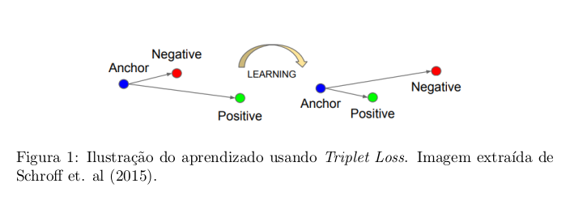
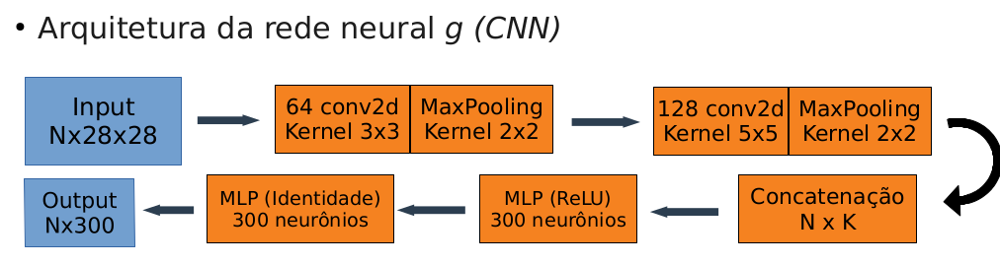
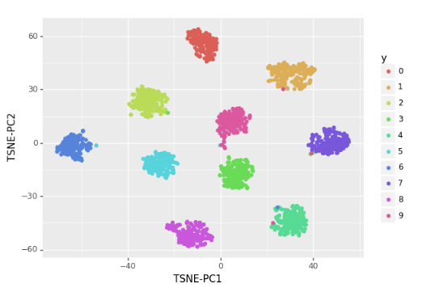
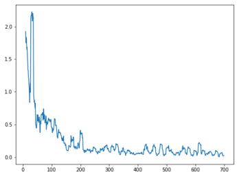
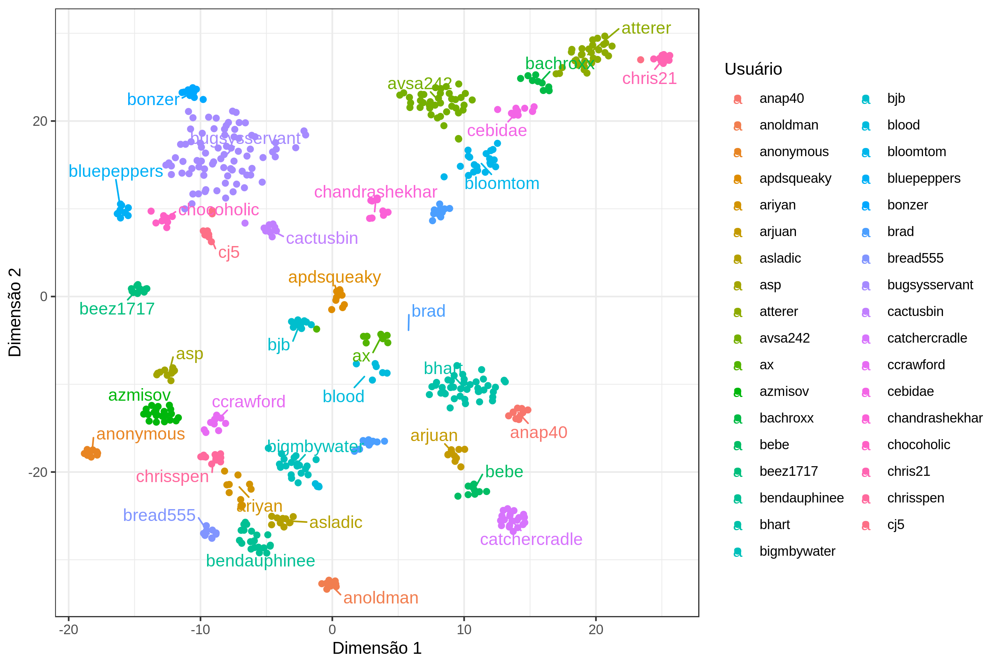

# Verificação de Locutor com *Triplet Loss*

**Trabalho de final de curso da disciplina PSI3501-2018**

Verificação de Locutor (VL) ou autenticação de locutor é uma tarefa de bio-
metria que consiste em confirmar a identidade de um indivı́duo i por meio de
comparações entre uma nova instância de voz, obtida no momento da verificação
(Y_i), e um banco de dados de gravações de voz (que possuı́ instâncias do usuário
i assim como dos demais usuários do sistema).

## *Triplet Loss*

### Tripla (A, P, N)
* Instância chave (A) de um usuário i
* Instância positiva (P) do mesmo usuário i
* Instância negativa (N) de um outro usuário j

**Objetivo**: Aprender uma função g:R^N->R^D (D<<N), que mantém g(A) mais perto de g(P) do que g(N), com uma margem m de segurança, isto é,

## *Toy example*: MNIST

Cada dígito (0-9) é considerado um usuário que produz multiplas instâncias.

### Matriz de distâncias

* Quadrantes diagonais: distâncias entre instâncias de um mesmo usuário
* Quadrantes restantes: distâncias entre usuários diferentes

### Embeddings (conjunto de teste)

## **Voxforge** dataset
 
* WAV 22050 Hz
* 187 Usuários (150 treino, 37 teste)

### Resultados

Com uma LSTM Bidirecional e a função de custo (método batch *hard*) com N= 10 e M = 5

#### Embeddings (dados de teste)

-------------------
